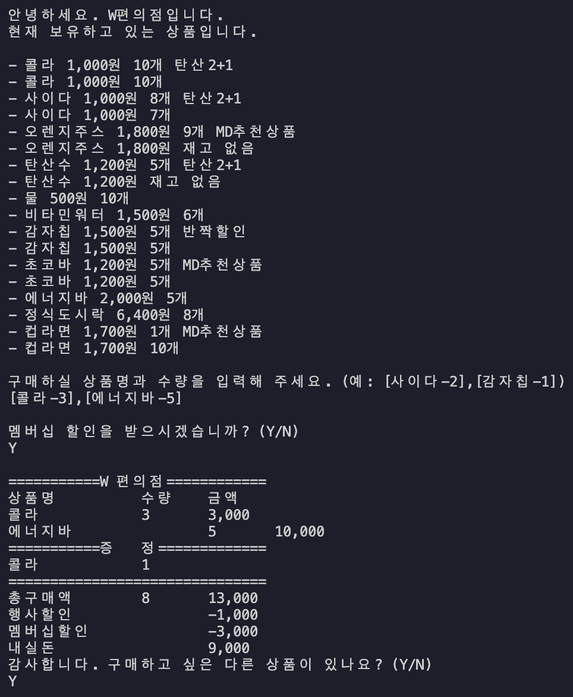

# 편의점(Convenience)

이 프로젝트는 우아한테크코스 프리코스 4주차 과제인 `구매자의 할인 혜택과 재고 상황을 고려하여 최종 결제 금액을 계산하고 안내`하는 **편의점**을 다루고 있습니다.

## 🎮 실행 결과 예시



# 🚀 기능 요구 사항

- 구매자의 할인 혜택과 재고 상황을 고려하여 **최종 결제 금액을 계산하고 안내하는** `결제 시스템`을 구현한다.
- 사용자가 입력한 상품의 `가격과 수량`을 기반으로 **최종 결제 금액**을 계산한다.
  | | 총 구매액 | 최종 결제 금액 |
  |---|---------|-------------|
  | 산출 |상품별 가격 x 수량|프로모션 및 멤버심 할인 정채 반영|
- 구매 내역과 산출한 금액 정보를 `영수증`으로 출력한다.
  - 영수증 출력 후 `추가 구매`를 선택할 수 있다.

## 기능 목록

### 재고 관리

- 재고 수량을 고려해 `결제 가능 여부` 확인
- 상품을 구매할 때마다 `결제 수량`만큼 재고에서 차감해 **수량을 관리**
- 다음 고객이 구매할 때 **정확한 재고 정보**를 제공하기 위해 `최신 재고 상태`를 유지

### 프로모션 할인

- `오늘 날짜`가 **프로모션 기간에 포함된 경우**만 할인 적용
- 동일 상품에 여러 프로모션이 `적용되지 않음`
  - 1+1 또는 2+1 프로모션이 각각 지정된 상품에 적용됨
- 프로모션 기간이라면 프로모션 재고를 `우선적으로 차감`하며, 부족한 경우 `일반 재고`를 사용
- **프로모션 메뉴얼**
  ||프로모션보다 적게 가져온 경우|프로모션 재고가 부족한 경우|
  |:------:|:----------------------:|:-------------------:|
  |안내사항 |필요한 수량을 가져오면 혜택을 받을 수 있음|일부 수량은 정가로 결제하게 됨|
  |선택지|추가 / 미추가|일부 수량 정가로 계산|

### 멤버십 할인

- 멤버십 회원은 프로모션에 `해당하지 않는 상품에 한해 30%` 할인
- 프로모션 적용 후 `남은 금액`에 대해 멤버십 할인 적용
- 멤버십 할인의 최대 한도는 `8,000원`
- **상황 예시**  
  |프로모션|멤버십 할인| 항목 |
  |:-----:|:------:|-----|
  | 2+1 |미해당 |콜라|
  | |해당 | 에너지바|
  |1+1|미해당|오렌지주스

### 영수증 출력

- 영수증은 고객의 `구매 내역과 할인`을 **요약**하여 출력
- 영수증 항목
  | 항목 | 내용 |
  |:-----:|----|
  |구매 상품|구매한 상품명, 수량, 가격|
  |증정 상품|프로모션에 따라 무료로 제공된 증정 상품 목록|
  |금액 정보|**총구매액**: 구매한 상품의 총 수량과 총 금액<br>**행사할인**: 프로모션에 의해 할인된 금액<br>**멤버십할인**: 멤버십에 의해 추가로 할인된 금액<br>**내실돈**: 최종 결제 금액|
  - 영수증의 구성 요소를 _보기 좋게 정렬_

### [ERROR]

- 사용자가 잘못된 값을 입력하면 _[ERROR]_ 메시지와 함께 `Error`를 발생시키고 **해당 지점부터 다시 입력**받는다.

---

## 입출력 요구 사항

### 입력

- 구현에 필요한 상품 목록과 행사 목록을 **파일 입출력**을 통해 불러온다.
  - `public/products.md`
  - `public/promotions.md`
  - 내용의 형식을 유지한다면 `값은 수정` 가능
- 구매할 상품과 수량을 **형식에 맞춰** 입력

```bash
[콜라-10],[사이다-3]
```

- 안내상황
  |상황|선택사항|선택지|
  |---|-----|:-----:|
  |프로모션 적용이 가능한데 적게 가져온 경우|추가 여부 선택|Y/N|
  |프로모션 재고가 부족해 일부 수량을 프로모션 혜택 없이 결제|일부 수량 정가 계산 선택|Y/N|
  |멤버십 할인|적용 여부 선택|Y/N|
  |추가 구매|추가 구매 여부 선택|Y/N|
  - 프로모션 재고가 부족한 상황에서 `N`을 누르면 **정가로 결제해야하는 수량만큼 제외 후** 결제 진행
  - 추가 구매 여부에서 `Y`를 선택한 경우 **업데이트된 상품 목록 확인 후** 구매 진행
  ```bash
  현재 {상품명}은(는) 1개를 무료로 더 받을 수 있습니다. 추가하시겠습니까? (Y/N)
  ```
  ```bash
  현재 {상품명} {수량}개는 프로모션 할인이 적용되지 않습니다. 그래도 구매하시겠습니까? (Y/N)
  ```
  ```bash
  멤버십 할인을 받으시겠습니까? (Y/N)
  ```

### 출력

- 환영 인사와 함께 `상품명, 가격, 프로모션 이름, 재고`를 안내
- 재고가 0개라면 `재고 없음`을 출력

```bash
안녕하세요. W편의점입니다.
현재 보유하고 있는 상품입니다.

- 콜라 1,000원 10개 탄산2+1
- 콜라 1,000원 10개
- 사이다 1,000원 8개 탄산2+1
- 사이다 1,000원 7개
- 오렌지주스 1,800원 9개 MD추천상품
- 오렌지주스 1,800원 재고 없음
- 탄산수 1,200원 5개 탄산2+1
- 탄산수 1,200원 재고 없음
- 물 500원 10개
- 비타민워터 1,500원 6개
- 감자칩 1,500원 5개 반짝할인
- 감자칩 1,500원 5개
- 초코바 1,200원 5개 MD추천상품
- 초코바 1,200원 5개
- 에너지바 2,000원 5개
- 정식도시락 6,400원 8개
- 컵라면 1,700원 1개 MD추천상품
- 컵라면 1,700원 10개

구매하실 상품명과 수량을 입력해 주세요.
```

#### 프로모션 적용이 가능한 상품에 대해 고객이 해당 수량만큼 가져오지 않았을 경우

```bash
현재 {상품명}은(는) 1개를 무료로 더 받을 수 있습니다. 추가하시겠습니까? (Y/N)
```

#### 프로모션 재고가 부족하여 일부 수량을 프로모션 혜택 없이 결제해야 하는 경우

```bash
현재 {상품명} {수량}개는 프로모션 할인이 적용되지 않습니다. 그래도 구매하시겠습니까? (Y/N)
```

#### 멤버십 할인 적용 여부를 확인하기 위해 안내 문구

```bash
멤버십 할인을 받으시겠습니까? (Y/N)
```

#### 영수증

- `구매 상품 내역, 증정 상품 내역, 금액 정보`를 출력

```bash
===========W 편의점=============
상품명		수량	금액
콜라		3 	3,000
에너지바 		5 	10,000
===========증	정=============
콜라		1
==============================
총구매액		8	13,000
행사할인			-1,000
멤버십할인			-3,000
내실돈			 9,000
```

#### 추가 구매 여부 확인 안내 문구

```bash
감사합니다. 구매하고 싶은 다른 상품이 있나요? (Y/N)
```

#### [ERROR] 메시지

- 사용자가 잘못된 값을 입력했을 때,`[ERROR]`로 시작하는 오류 메시지와 상황에 맞는 안내를 출력
- **구매할 상품과 수량 형식이 올바르지 않은 경우**

```bash
[ERROR] 올바르지 않은 형식으로 입력했습니다. 다시 입력해 주세요.
```

- **존재하지 않는 상품을 입력한 경우**

```bash
[ERROR] 존재하지 않는 상품입니다. 다시 입력해 주세요.
```

- **구매 수량이 재고 수량을 초과한 경우**

```bash
[ERROR] 재고 수량을 초과하여 구매할 수 없습니다. 다시 입력해 주세요.
```

- **기타 잘못된 입력의 경우**

```bash
[ERROR] 잘못된 입력입니다. 다시 입력해 주세요.
```

### 실행 결과 예시

```bash
안녕하세요. W편의점입니다.
현재 보유하고 있는 상품입니다.

- 콜라 1,000원 10개 탄산2+1
- 콜라 1,000원 10개
- 사이다 1,000원 8개 탄산2+1
- 사이다 1,000원 7개
- 오렌지주스 1,800원 9개 MD추천상품
- 오렌지주스 1,800원 재고 없음
- 탄산수 1,200원 5개 탄산2+1
- 탄산수 1,200원 재고 없음
- 물 500원 10개
- 비타민워터 1,500원 6개
- 감자칩 1,500원 5개 반짝할인
- 감자칩 1,500원 5개
- 초코바 1,200원 5개 MD추천상품
- 초코바 1,200원 5개
- 에너지바 2,000원 5개
- 정식도시락 6,400원 8개
- 컵라면 1,700원 1개 MD추천상품
- 컵라면 1,700원 10개

구매하실 상품명과 수량을 입력해 주세요. (예: [사이다-2],[감자칩-1])
[콜라-3],[에너지바-5]

멤버십 할인을 받으시겠습니까? (Y/N)
Y

===========W 편의점=============
상품명		수량	금액
콜라		3 	3,000
에너지바 		5 	10,000
===========증	정=============
콜라		1
==============================
총구매액		8	13,000
행사할인			-1,000
멤버십할인			-3,000
내실돈			 9,000

감사합니다. 구매하고 싶은 다른 상품이 있나요? (Y/N)
Y

안녕하세요. W편의점입니다.
현재 보유하고 있는 상품입니다.

- 콜라 1,000원 7개 탄산2+1
- 콜라 1,000원 10개
- 사이다 1,000원 8개 탄산2+1
- 사이다 1,000원 7개
- 오렌지주스 1,800원 9개 MD추천상품
- 오렌지주스 1,800원 재고 없음
- 탄산수 1,200원 5개 탄산2+1
- 탄산수 1,200원 재고 없음
- 물 500원 10개
- 비타민워터 1,500원 6개
- 감자칩 1,500원 5개 반짝할인
- 감자칩 1,500원 5개
- 초코바 1,200원 5개 MD추천상품
- 초코바 1,200원 5개
- 에너지바 2,000원 재고 없음
- 정식도시락 6,400원 8개
- 컵라면 1,700원 1개 MD추천상품
- 컵라면 1,700원 10개

구매하실 상품명과 수량을 입력해 주세요. (예: [사이다-2],[감자칩-1])
[콜라-10]

현재 콜라 4개는 프로모션 할인이 적용되지 않습니다. 그래도 구매하시겠습니까? (Y/N)
Y

멤버십 할인을 받으시겠습니까? (Y/N)
N

===========W 편의점=============
상품명		수량	금액
콜라		10 	10,000
===========증	정=============
콜라		2
==============================
총구매액		10	10,000
행사할인			-2,000
멤버십할인			-0
내실돈			 8,000

감사합니다. 구매하고 싶은 다른 상품이 있나요? (Y/N)
Y

안녕하세요. W편의점입니다.
현재 보유하고 있는 상품입니다.

- 콜라 1,000원 재고 없음 탄산2+1
- 콜라 1,000원 7개
- 사이다 1,000원 8개 탄산2+1
- 사이다 1,000원 7개
- 오렌지주스 1,800원 9개 MD추천상품
- 오렌지주스 1,800원 재고 없음
- 탄산수 1,200원 5개 탄산2+1
- 탄산수 1,200원 재고 없음
- 물 500원 10개
- 비타민워터 1,500원 6개
- 감자칩 1,500원 5개 반짝할인
- 감자칩 1,500원 5개
- 초코바 1,200원 5개 MD추천상품
- 초코바 1,200원 5개
- 에너지바 2,000원 재고 없음
- 정식도시락 6,400원 8개
- 컵라면 1,700원 1개 MD추천상품
- 컵라면 1,700원 10개

구매하실 상품명과 수량을 입력해 주세요. (예: [사이다-2],[감자칩-1])
[오렌지주스-1]

현재 오렌지주스은(는) 1개를 무료로 더 받을 수 있습니다. 추가하시겠습니까? (Y/N)
Y

멤버십 할인을 받으시겠습니까? (Y/N)
Y

===========W 편의점=============
상품명		수량	금액
오렌지주스		2 	3,600
===========증	정=============
오렌지주스		1
==============================
총구매액		2	3,600
행사할인			-1,800
멤버십할인			-0
내실돈			 1,800

감사합니다. 구매하고 싶은 다른 상품이 있나요? (Y/N)
N
```

---

## 🛠️ 구현 상세

### Promotion 클래스

- 특정 상품의 **프로모션 정보 관리**
  - 재고 관리 포함
  - 요청 수량에 프로모션 혜택 적용을 도움

##### 주요 기능

- 프로모션 생성: 상품의 이름, 유형, 수량, 프로모션 기간으로 초기화
- 유효성 검사: 프로모션의 만료 여부를 검사
- 프로모션 혜택 계산: 프로모션 혜택 적용 가능 수량을 판단하고, 위반 사항을 계산
- 프로모션 재고 감소: 프로모션 적용 시 소모되는 재고 관리

#### DateRange 클래스

- `Promotion` 클래스의 프로모션 기간과 관련된 날짜 처리 로직

##### 주요 기능

- 날짜 범위 설정: 시작과 종료일을 기반으로 객체 초기화
- 유효성 검사: 날짜가 범위 내에 들어있는지 확인

##### 사용 예시

```javascript
const promoDateRange = new DateRange('2024-01-01', '2024-12-31');
```

```javascript
const promotionData = {
  name: '탄산2+1',
  type: PromotionType.TWO_PLUS_ONE,
  quantity: 10,
  start_date: '2024-01-01',
  end_date: '2024-12-31',
};

const promotion = new Promotion(promotionData);
const availableQuantity = promotion.getAvailableQuantity(3); // 수량에 따른 혜택 제공
```

### Shelves 클래스

- 편의점 제품 및 프로모션 관련 데이터 관리
  - 제품의 가격, 재고 수량, 프로모션 정보를 담음
  - 결제와 관련된 정보를 제공할 수 있음

```javascript
new Shelves(products, promotions);
```

- `prducts`는 `name`, `price`, `quantity`, `promotion` 키를 포함
- `promotions`는 `name`, `type`, `start_date`, `end_date` 키를 포함

#### 주요 메서드

- `tryFetchGoods(goodsName, regularQuantity, promotionalQuantity)`: 재고를 확인하고 요청 수량만큼 감소

- `summary`: 제품 정보를 요약해 반환
- `toString()`: 제품 정보와 재고 상황을 **문자열**로 반환

### Cart 클래스

- 사용자가 **입력한 상품명과 수량**을 바탕으로 장바구니 항목 생성
  - 유효성 검증
  - 중복된 상품 예외처리
  - 장바구니 목록을 `goods`로 제공

```javascript
  constructor(userInput) {
    this.#validateUserInputFormat(userInput);
    const parsedList = this.#parseInputToList(userInput);

    this.#items = this.#removeDuplicateItems(parsedList);
  }
```

- `#validateUserInputFormat(userInput)`
  - 입력 형식이 정규표현식 패턴에 맞는지 검증
- `#parseInputToList(userInput)`
  - 입력 문자열을 분리해 각 항목으로 변환
  - `{name, quantity}` 형식으로 객체 배열 반환
- `#parseSingleItem(item)`
  - 단일 상품 항목을 `{name, quantity}` 형식으로 파싱
- `#removeDuplicateItems(parsedList)`
  - 중복된 상품인경우 예외처리
- `get goods`
  - 장바구니에 추가된 상품 목록 반환
  - `[{ name, quantity }]`

#### 사용 예시

```javascript
try {
  const cart = new Cart('[사이다-2],[감자칩-1]');
  Console.print(cart.goods); // [ { name: '사이다', quantity: 2 }, { name: '감자칩', quantity: 1 }]
} catch (error) {
  console.error(error.message);
}
```

### Inventory 클래스

- 편의점 상품의 재고와 프로모션 상태 관리 및 결제 정보 제공
  - 상품 결제 정보 제공: 사용자의 요청에 따라 **결제 요약 정보** 생성
  - 재고 감소: 구매를 확정한 경우 **상품 수량 감소**
  - 프로모션 상태 관리: 상품의 프로모션 정보를 확인하고 부합 여부 검사

```javascript
  constructor(data, promotion) {
    this.#initializeData(data);
    this.#promotion = new Promotion(promotion);
  }

  getPaymentSummary(requestedQuantity) {
    this.#validateStock(requestedQuantity);
    const { promotionalQuantity, freebieCount, violation } =
      this.#calculatePromotions(requestedQuantity);
    const regularQuantity = requestedQuantity - promotionalQuantity;
    return this.#createPaymentSummary(
      requestedQuantity,
      regularQuantity,
      promotionalQuantity,
      freebieCount,
      violation
    );
  }
```

- `생성자`: 상품의 이름, 가격, 초기 수량, 프로모션 정보 초기화
- `getPaymentSummary(requestedQuantity)`: 사용자의 요청을 기준으로 *프로모션 조건과 적용 가능한 무료 상품 수량 계산*을 통해 결제 요약 정보 반환
- `decrease(regularQuantity, promotionalQuantity)`: 최종 구매 결정에서 **재고 업데이트**
- `summary`: 상품 이름, 가격, 잔여 재고 정보 반환

### Checkout 클래스

- 사용자가 장바구니에 담은 목록을 바탕으로 **결제 계획과 요약 정보 생성**
- `Shelves` 객체를 기반으로 상품 정보 확인 및 결제 요약 정보 반환

```javascript
constructor(shelves); // 재고 정보를 담고 있음
```

#### 주요 메서드

- `createPaymentPlan(shoppingCart)`: 장바구니를 바탕으로 결제 요약을 생성
- `createPaymentSummary(name, quantity)`: *특정 상품*에 대한 결제 요약 생성

#### 사용 예시

```javascript
import Checkout from './Checkout.js';
import Shelves from './Shelves.js';

const shelves = new Shelves(productList, promotionList);
const checkout = new Checkout(shelves);

const paymentPlan = checkout.createPaymentPlan(cart);
```

### Cashier 클래스

- 영수증을 생성하는 역할
  - 결제에 필요한 각종 계산을 수행한다.
  - 할인을 반영해 `Receipt` 인스턴스를 반환한다.

```javascript
  checkout(confirmedPlans, shouldDiscount) {
    const results = confirmedPlans.map((plan) => this.#processPlan(plan));
    const sumOfPrice = this.#calculateTotalPrice(results);
    const goodsCount = this.#calculateTotalCount(results);
    const discountByMembership = this.#calculateDiscountByMembership(
      results,
      shouldDiscount
    );

    return new Receipt(sumOfPrice, goodsCount, results, discountByMembership);
  }
```

`confirmedPlans`를 바탕으로 전체 결제 금액을 계산하고 **영수증을 생성**한다.

#### 사용 예시

```javascript
const cashier = new Cashier(8000, 0.3);

const confirmedPlans = [
  {
    name: '콜라',
    price: 1000,
    requestedQuantity: 6,
    freebieCount: 2,
    quantity: { regular: 0, promotional: 6 },
  },
  {
    name: '사이다',
    price: 1000,
    requestedQuantity: 4,
    freebieCount: 1,
    quantity: { regular: 3, promotional: 1 },
  },
];

const shouldDiscount = true;
const receipt = cashier.checkout(confirmedPlans, shouldDiscount);
```

### Receipt 클래스

- 결제 정보를 기반으로 **영수증 생성**
- `총 구매액, 행사 할인, 멤버십 할인, 내실 돈`을 포함한 최종 영수증 출력

#### 주요 기능

- 영수증 생성
- 할인 계산: 행사 및 멤버십 할인을 계산해 **최종 결제 금액 반영**
- toString() 메서드를 제공

```javascript
constructor(price, count, data, discountByMembership);
```

- `price` 총 구매 금액
- `count` 총 구매 수량
- `data` 품목의 정보를 담는 객체 배열(품목 이름, 수량, 가격, freebie)
- `discountByMembership` 멤버십 할인 금액

#### 사용 예시

```javascript
const data = [
  { name: '콜라', count: 3, price: 3000, freebie: { count: 1, price: 1000 } },
  { name: '에너지바', count: 5, price: 10000, freebie: null },
];

const receipt = new Receipt(priceSum, countSum, data, discountByMembership);
```

### toString() 예시

```bash
===========W 편의점============
상품명         수량    금액
콜라            3       3,000
에너지바         5       10,000
===========증    정=============
콜라            1
===============================
총구매액         8       13,000
행사할인                 -1,000
멤버십할인               -3,000
내실돈                   9,000
```

### Controller

1. `#startStep()`

- 편의점 서비스 시작 시 인사말과 상품 목록을 표시
- 구매할 상품과 수량을 입력

```javascript
async #startStep() {
  const greeting = [MESSAGES.GREETING, this.#shelf.toString(), ''].join('\n');
  this.#std.write(greeting);
  return this.#std.readLine(MESSAGES.PROMPT_PRODUCT_INPUT);
}
```

2. `#selectGoodsStep(goodsInput)`

- 사용자가 입력한 상품 목록을 기반으로 Cart 객체를 생성
- 구매 계획 초안을 작성

```javascript
async #selectGoodsStep(goodsInput) {
    let currentInput = goodsInput;
    while (true) {
        try {
            const shoppingCart = new Cart(currentInput);
            return this.#paymentPlanner.createPaymentPlan(shoppingCart);
        } catch (e) {
            this.#std.write(e.message);
            currentInput = await this.#std.readLine(`\n`);
        }
    }
}
```

3. `#postSelectGoodsStep(paymentSummaries)`

- 구매 계획 초안을 점검
- 추가 구매 및 재고 프로모션 상황에 따라 최종 구매 계획을 작성합니다.

```javascript
async #postSelectGoodsStep(paymentSummaries) {
    const confirmedPlans = [];

    for (const summary of paymentSummaries) {
        if (summary.violation.type) {
            const plan = await this.#handleViolatedPurchase(summary);
            confirmedPlans.push(plan);
        } else {
            const plan = this.#confirmPlan(summary);
            confirmedPlans.push(plan);
        }
    }

    return confirmedPlans;
}
```

4. `#checkoutStep(confirmedPlans)`

- 최종 구매를 바탕으로 결제 진행
- 재고를 차감

```javascript
async #checkoutStep(confirmedPlans) {
    const shouldDiscount = await this.#shouldDiscount();
    const result = this.#cashier.checkout(confirmedPlans, shouldDiscount);

    for (const plan of confirmedPlans) {
        this.#shelf.tryFetchGoods(plan.name, plan.quantity.regular, plan.quantity.promotional);
    }

    return result;
}
```

## 📄 테스트(Testing)

- 단위 테스트(Unit Testing)를 통해 예외 상황과 함수 동작을 검증했습니다.
- 테스트는 `Jest`를 사용했으며, 다음과 같은 **주요 함수**를 테스트했습니다.

### 주요 테스트 기능

#### Promotion 클래스

1. **유효하지 않은 프로모션 타입 처리**

   - **목적**: `Promotion` 객체 생성 시 유효하지 않은 프로모션 타입이 입력된 경우, 예외 발생 테스트
   - **테스트 예시**:
     ```javascript
     const invalidType = 'INVALID_TYPE';
     expect(() => {
       new Promotion({
         name: '탄산2+1',
         type: invalidType,
         quantity: 10,
         start_date: '2024-01-10',
         end_date: '2024-01-17',
       });
     }).toThrow('[ERROR] 잘못된 입력입니다. 다시 입력해 주세요.');
     ```

2. **구매 수량 0 요청 처리**

   - **목적**: `getAvailableQuantity` 메소드 호출 시 구매 수량이 0인 경우, 예외 발생 테스트
   - **테스트 예시**:
     ```javascript
     const promotion = new Promotion({
       name: '탄산2+1',
       type: 'TWO_PLUS_ONE',
       quantity: 10,
     });
     expect(() => promotion.getAvailableQuantity(0)).toThrow(
       '[ERROR] 잘못된 입력입니다. 다시 입력해 주세요.'
     );
     ```

3. **프로모션 기간 외의 요청 처리**

   - **목적**: 현재 일자가 프로모션 기간 범위에 포함되지 않는 경우, `getAvailableQuantity` 메소드가 0을 반환하는지 테스트
   - **테스트 예시**:
     ```javascript
     const promotion = new Promotion({
       name: '탄산2+1',
       type: 'TWO_PLUS_ONE',
       quantity: 10,
       start_date: '2024-01-10',
       end_date: '2024-01-17',
     });
     const result = promotion.getAvailableQuantity(3);
     expect(result).toEqual({ quantity: 0, violation: null });
     ```

4. **프로모션 타입이 null일 때 0 반환**

   - **목적**: `type`이 `null`인 경우, `getAvailableQuantity` 메소드가 항상 0을 반환하는지 테스트
   - **테스트 예시**:
     ```javascript
     const promotion = new Promotion({ name: '', type: null, quantity: 10 });
     const result = promotion.getAvailableQuantity(10);
     expect(result).toEqual({ quantity: 0, violation: null, freebieCount: 0 });
     ```

5. **재고 감소 처리**

   - **목적**: `decrease()` 메소드를 통해 프로모션 재고 수량을 정확히 감소시키는지 테스트
   - **테스트 예시**:
     ```javascript
     const promotion = new Promotion({
       name: '탄산2+1',
       type: 'TWO_PLUS_ONE',
       quantity: 10,
     });
     promotion.decrease(3);
     expect(promotion.summary).toEqual({ name: '탄산2+1', quantity: 7 });
     ```

6. **재고 초과 감소 요청 처리**

   - **목적**: `decrease()` 호출 시 현재 재고 수량을 초과하는 감소 요청이 들어온 경우, 예외를 발생시키는지 테스트
   - **테스트 예시**:
     ```javascript
     const promotion = new Promotion({
       name: '탄산2+1',
       type: 'TWO_PLUS_ONE',
       quantity: 10,
     });
     expect(() => promotion.decrease(11)).toThrow(
       '[ERROR] 재고 수량을 초과하여 구매할 수 없습니다. 다시 입력해 주세요.'
     );
     ```

7. **프로모션 재고 조회**
   - **목적**: `summary` 프로퍼티를 통해 현재 프로모션 재고 정보를 정확히 반환하는지 테스트
   - **테스트 예시**:
     ```javascript
     const promotion = new Promotion({
       name: '탄산2+1',
       type: 'TWO_PLUS_ONE',
       quantity: 10,
     });
     expect(promotion.summary).toEqual({ name: '탄산2+1', quantity: 10 });
     ```

#### Shelves 클래스

### Shelves 클래스 주요 테스트 기능

1. **인스턴스화 및 정보 확인**

   - **목적**: `Shelves` 클래스가 정상적으로 인스턴스화되었을 때 `summary` 프로퍼티를 통해 상품 목록과 프로모션 정보를 확인할 수 있는지 테스트
   - **테스트 예시**:
     ```javascript
     const shelves = new Shelves(products, promotions);
     expect(shelves.summary).toEqual([
       {
         name: '콜라',
         price: 1000,
         quantity: 10,
         promotion: { name: '탄산2+1', quantity: 10 },
       },
       // ... 기타 상품들
     ]);
     ```

2. **재고 감소 처리**

   - **목적**: `tryFetchGoods()` 메소드를 호출하여 특정 제품의 일반 및 프로모션 재고를 정확히 감소시키는지 테스트
   - **테스트 예시**:
     ```javascript
     const shelves = new Shelves(products, promotions);
     const result = shelves.tryFetchGoods('탄산수', 0, 3);
     expect(result).toEqual({
       name: '탄산수',
       quantity: {
         regular: 0,
         promotional: 3,
       },
     });
     ```

3. **재고 정보 확인 (toString 메소드)**
   - **목적**: `toString()` 메소드를 호출하여 진열된 모든 상품의 재고 상태를 문자열 형태로 확인할 수 있는지 테스트
   - **테스트 예시**:
     ```javascript
     const shelves = new Shelves(products, promotions);
     const result = shelves.toString();
     expect(result).toBe(`- 콜라 1,000원 10개 탄산2+1
     - 콜라 1,000원 10개
     - 사이다 1,000원 8개 탄산2+1
     // ... 기타 상품들
     - 컵라면 1,700원 1개 MD추천상품
     - 컵라면 1,700원 10개`);
     ```

#### Cart 클래스

1. **잘못된 입력 형식 처리**

   - **목적**: `Cart` 클래스 생성자에 전달된 인자가 문자열이 아닌 경우, 에러 메시지와 함께 예외 발생 테스트
   - **테스트 예시**:
     ```javascript
     new Cart(1); // [ERROR] 올바르지 않은 형식으로 입력했습니다. 다시 입력해 주세요.
     ```

2. **잘못된 상품 정보 형식 처리**

   - **목적**: 상품 정보가 잘못된 형태`(공백, 형식 오류, 잘못된 수량 등)`로 입력된 경우 예외 발생 테스트
   - **테스트 예시**:
     ```javascript
     new Cart(' ');
     new Cart('[콜라-10],[사이다--3]'); // [ERROR] 올바르지 않은 형식으로 입력했습니다. 다시 입력해 주세요.
     ```

3. **단일 상품 정보 파싱**

   - **목적**: 올바른 형식의 단일 상품 정보를 입력했을 때, 이를 올바르게 파싱하여 `goods` 배열로 확인할 수 있는지 테스트
   - **테스트 예시**:
     ```javascript
     const cart = new Cart('[콜라-10]');
     console.log(cart.goods); // [{ name: '콜라', quantity: 10 }]
     ```

4. **다수 상품 정보 파싱**

   - **목적**: 여러 개의 상품 정보가 올바르게 파싱되어 `goods` 배열로 저장되는지 확인
   - **테스트 예시**:
     ```javascript
     const cart = new Cart(
       '[콜라-10],[사이다-3],[오렌지주스-2],[탄산수-8],[컵라면-1]'
     );
     console.log(cart.goods);
     //  [
     //      { name: '콜라', quantity: 10 },
     //      { name: '사이다', quantity: 3 },
     //      { name: '오렌지주스', quantity: 2 },
     //      { name: '탄산수', quantity: 8 },
     //      { name: '컵라면', quantity: 1 }
     //    ]
     ```

5. **중복된 상품 정보 입력 시 예외 처리**
   - **목적**: 동일한 상품이 중복으로 입력된 경우, 에러 메시지와 함께 예외가 발생하는지 확인합니다.
   - **테스트 예시**:
     ```javascript
     new Cart('[콜라-10],[콜라-10]'); // [ERROR] 올바르지 않은 형식으로 입력했습니다. 다시 입력해 주세요.
     ```

#### Inventory 클래스

1. **재고 감소 처리**

   - **목적**: `decrease()` 메소드를 호출하여 일반 재고와 프로모션 재고를 정확히 감소시키는지 테스트
   - **테스트 예시**:

     ```javascript
     const goods = createGoods(999, 10);
     goods.decrease(42, 3);

     expect(goods.summary).toEqual({
       name: '콜라',
       price: 1000,
       quantity: 957,
       promotion: {
         name: '탄산2+1',
         quantity: 7,
       },
     });
     ```

2. **재고 초과 요청 처리**

   - **목적**: 현재 재고보다 많은 수량을 감소하려는 경우, 예외를 발생시키는지 테스트
   - **테스트 예시**:

     ```javascript
     const goods = createGoods(10, 5);

     expect(() => {
       goods.decrease(20, 0);
     }).toThrow(
       '[ERROR] 재고 수량을 초과하여 구매할 수 없습니다. 다시 입력해 주세요.'
     );
     ```

3. **현재 재고 조회**

   - **목적**: `summary` 속성을 통해 현재 재고 정보를 정확히 반환하는지 테스트
   - **테스트 예시**:

     ```javascript
     const goods = createGoods(999, 10);
     const result = goods.summary;

     expect(result).toEqual({
       name: '콜라',
       price: 1000,
       quantity: 999,
       promotion: {
         name: '탄산2+1',
         quantity: 10,
       },
     });
     ```

4. **2+1 프로모션 적용**

   - **목적**: 2+1 프로모션이 적용된 제품에 대해 프로모션 조건이 올바르게 반영되는지 테스트
   - **테스트 예시**:

     ```javascript
     const goods = createGoods();

     // 모든 혜택 적용 가능
     let paymentSummary = goods.getPaymentSummary(6);
     expect(paymentSummary.quantity.regular).toBe(0);
     expect(paymentSummary.quantity.promotional).toBe(6);

     // 일부 혜택만 적용
     paymentSummary = goods.getPaymentSummary(4);
     expect(paymentSummary.quantity.regular).toBe(1);
     expect(paymentSummary.quantity.promotional).toBe(3);

     // 프로모션 재고 부족으로 violation 발생
     goods.decrease(0, 7); // 프로모션 재고 감소
     paymentSummary = goods.getPaymentSummary(5);
     expect(paymentSummary.violation.type).toBe(
       PromotionViolation.OUT_OF_STOCK
     );
     ```

5. **1+1 프로모션 적용**

   - **목적**: 1+1 프로모션이 적용된 제품에 대해 프로모션 조건이 올바르게 반영되는지 테스트
   - **테스트 예시**:

     ```javascript
     const goods = createGoods();

     // 모든 혜택 적용 가능
     let paymentSummary = goods.getPaymentSummary(4);
     expect(paymentSummary.quantity.regular).toBe(0);
     expect(paymentSummary.quantity.promotional).toBe(4);

     // 일부 혜택만 적용 가능
     paymentSummary = goods.getPaymentSummary(5);
     expect(paymentSummary.quantity.regular).toBe(1);
     expect(paymentSummary.quantity.promotional).toBe(4);
     expect(paymentSummary.violation.type).toBe(PromotionViolation.ONE_MORE);

     // 프로모션 재고 및 일반 재고 부족으로 예외 발생
     expect(() => {
       goods.getPaymentSummary(1000);
     }).toThrow(
       '[ERROR] 재고 수량을 초과하여 구매할 수 없습니다. 다시 입력해 주세요.'
     );
     ```

### 실행 방법

다음 명령어로 실행할 수 있습니다.

```bash
npm test
```
